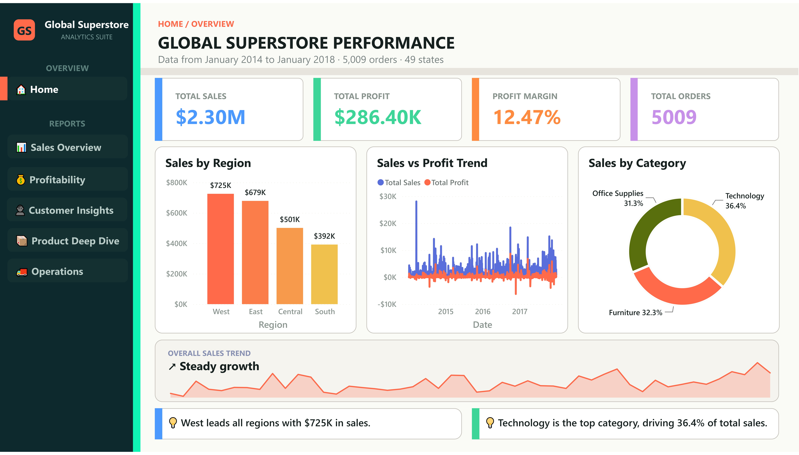
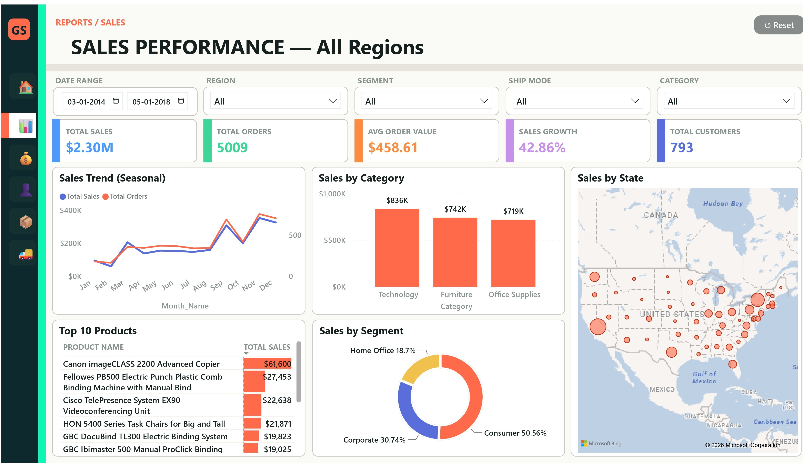
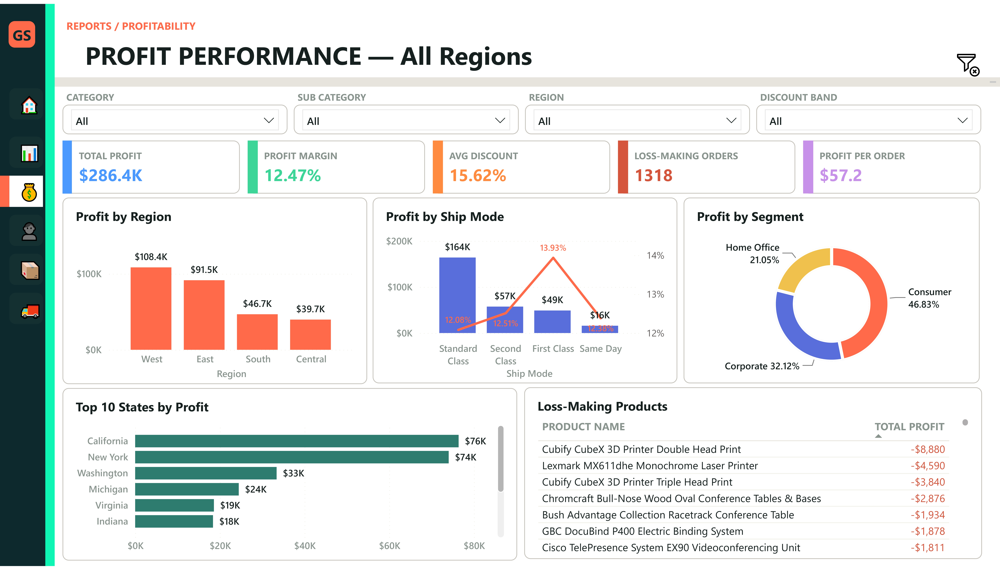
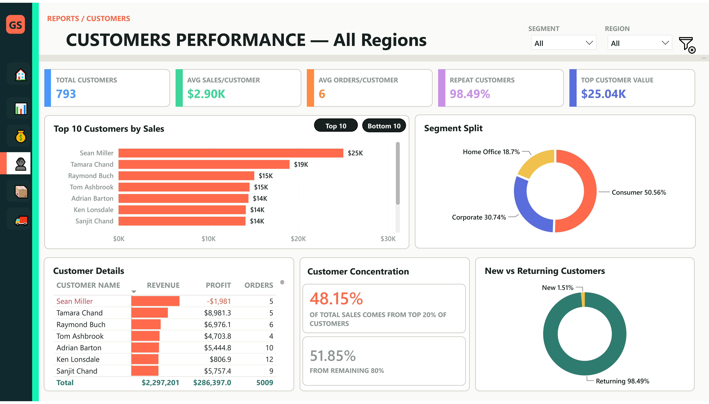
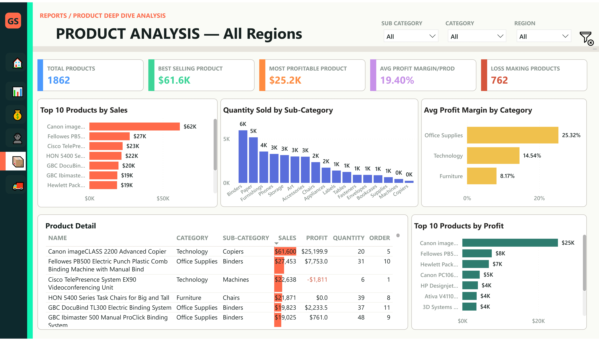
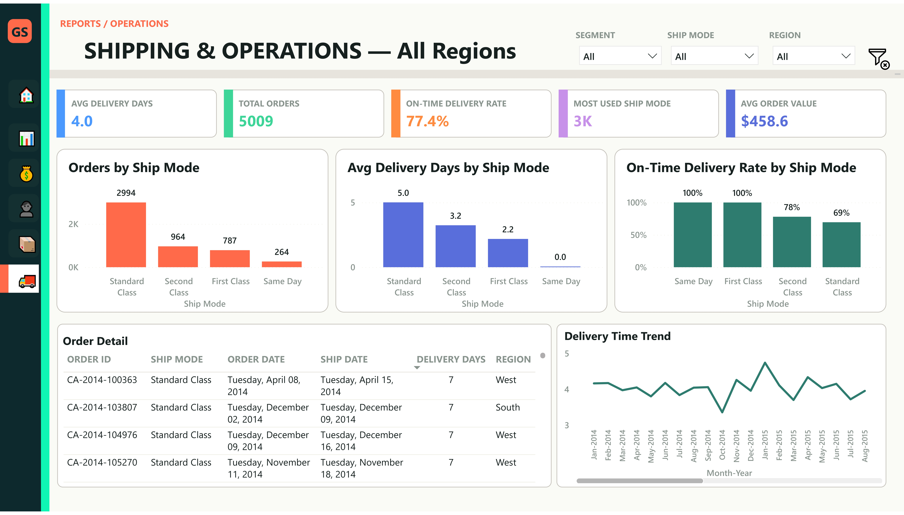
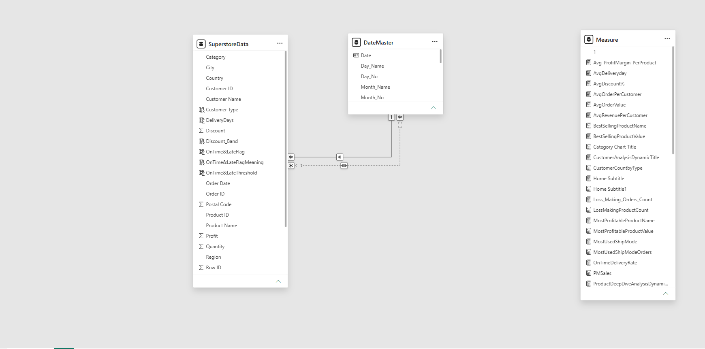

<div align="center">

# 📊 Superstore Sales Analysis — Power BI Dashboard

### End-to-end retail sales, profitability & customer intelligence dashboard built on the Sample Superstore dataset

[](https://powerbi.microsoft.com/)
[](#-dax-measures)
[](#-etl--data-transformation)
[](#-data-model)
[](#)

<br>

<!-- 🖼️ Add a hero GIF/screenshot of the Home page here once exported -->
<!--  -->

</div>

---

## 📑 Table of Contents

- [Overview](#-overview)
- [Key Features](#-key-features)
- [Dashboard Preview](#️-dashboard-preview)
- [Data Model](#️-data-model)
- [DAX Measures](#-dax-measures)
- [ETL / Data Transformation](#-etl--data-transformation)
- [Tech Stack](#️-tech-stack)
- [Repository Structure](#-repository-structure)
- [How to Use](#-how-to-use)
- [Business Problem & Insights](#-business-problem--insights)
- [Key Insights (Summary)](#-key-insights)
- [Author](#-author)
- [License](#-license)

---

## 📌 Overview

This project is a **6-page interactive Power BI dashboard** built on the classic **Sample Superstore** dataset (2014–2017, US retail operations). It transforms 9,994 raw transaction records into a decision-ready analytics suite covering **sales performance, profitability, customer behavior, product trends, and shipping operations**.

The goal was to go beyond static charts and build a dashboard that *feels like a product* — dynamic titles that respond to filters, contextual tooltip pages, auto-generated insight callouts, KPI cards with YoY/MoM trends, and a clean, consistent visual design system across every page.

| | |
|---|---|
| 🗂️ **Records analyzed** | 9,994 transactions \| 5,009 orders |
| 💰 **Total Sales** | ~$2.30M |
| 📈 **Total Profit** | ~$286K |
| 👥 **Customers** | 793 unique customers |
| 📦 **Products** | 1,862 unique SKUs across 3 categories / 17 sub-categories |
| 🌎 **Coverage** | 49 states \| 531 cities \| 4 US regions |
| 📅 **Time Range** | Jan 2014 – Jan 2018 |

---

## ✨ Key Features

- **6 fully designed report pages** + 3 dedicated tooltip pages (report-page tooltips on hover)
- **60+ custom DAX measures** — core KPIs, time intelligence (YTD/QTD/MTD, YoY%, MoM%, rolling averages), dynamic titles, and Pareto (80/20) customer analysis
- **Dynamic page titles & subtitles** that update automatically based on slicer/region selection
- **Auto-generated insight callouts** (e.g., top-performing region/category) written entirely in DAX
- **Drill-through & tooltip pages** for Category, State, and Region-level context on hover
- **Consistent design system** — 1280×720 canvas, custom KPI cards, icon-driven navigation buttons across all pages
- **Clean ETL pipeline** in Power Query — type casting, locale-aware date parsing, text trimming/cleaning, and derived columns (Delivery Days, On-Time/Late Flag, Discount Band, Customer Type)

---

## 🖥️ Dashboard Preview

### 1️⃣ Home
Landing page with headline KPIs (Total Sales, Profit, Orders, Customers), a **Sales by Region** column chart, **Sales vs Profit Trend** line chart, **Sales by Category** donut, and navigation buttons into every other page.



### 2️⃣ Sales Overview
Deep dive into revenue performance: **Sales Trend (Seasonal)**, **Sales by Category**, **Sales by Segment**, a **Sales by State** map, and a **Top 10 Products** table — filterable by Region, Segment, and Category slicers.



### 3️⃣ Profitability
Margin and loss analysis: **Profit by Region**, **Profit by Segment**, **Top 10 States by Profit**, a **Loss-Making Products** table, and a **Profit by Ship Mode** combo chart.



### 4️⃣ Customer Insights
Customer segmentation and value analysis: **Segment Split**, **Top 10 / Bottom 10 Customers by Sales**, **New vs Returning Customers**, a **Customer Details** table, and Pareto-based Top 20% customer contribution metrics.



### 5️⃣ Product Deep Dive
Product-level performance: **Top 10 Products by Sales**, **Top 10 Products by Profit**, **Quantity Sold by Sub-Category**, a **Product Detail** table, and **Avg Profit Margin by Category**.



### 6️⃣ Shipping & Operations
Logistics and fulfillment analysis: **Orders by Ship Mode**, **Avg Delivery Days by Ship Mode**, **Delivery Time Trend**, an **Order Detail** table, and **On-Time Delivery Rate by Ship Mode**.



---

## 🗃️ Data Model

The model follows a **star-schema** approach with a central fact table and supporting dimension/measure tables.



| Table | Type | Description |
|---|---|---|
| **SuperstoreData** | Fact | 9,994 rows × 27 columns — orders, products, customers, sales, profit, discount, shipping & delivery metrics |
| **DateMaster** | Dimension | Custom calendar table powering all time-intelligence measures (YTD, QTD, MTD, YoY, MoM) |
| **Measure** | Measure table | Dedicated (disconnected) table used purely to organize all 60+ DAX measures outside the fact table |
| Auto Date Tables | Hidden | Power BI's built-in date hierarchy tables (used internally for local date filtering) |

**Key derived columns** created in Power Query / DAX:
- `DeliveryDays` — Ship Date − Order Date
- `OnTime&LateFlag` / `OnTime&LateFlagMeaning` — SLA compliance flag vs. threshold
- `Discount_Band` — categorized discount tiers
- `Customer Type` — New vs. Returning classification

---

## 🧮 DAX Measures

A sample of the 60+ measures used across the report (organized by category):

<details>
<summary><strong>📌 Core KPIs</strong></summary>

```dax
Total Sales = SUM(SuperstoreData[Sales])

Total Profit = SUM(SuperstoreData[Profit])

Total Orders = DISTINCTCOUNT(SuperstoreData[Order ID])

Total Customers = DISTINCTCOUNT(SuperstoreData[Customer ID])

ProfitMargin% = DIVIDE([Total Profit], [Total Sales], 0)

AvgOrderValue = DIVIDE([Total Sales], [Total Orders], 0)
```
</details>

<details>
<summary><strong>📅 Time Intelligence</strong></summary>

```dax
Sales YTD = TOTALYTD([Total Sales], DateMaster[Date])

SalesQTD = TOTALQTD([Total Sales], DateMaster[Date])

SaleMTD = TOTALMTD([Total Sales], DateMaster[Date])

TotalSales YoY% =
VAR __PREV_YEAR = CALCULATE([Total Sales], DATEADD('DateMaster'[Date], -1, YEAR))
RETURN DIVIDE([Total Sales] - __PREV_YEAR, __PREV_YEAR)

Sales Rolling 3Month Avg =
AVERAGEX(
    DATESINPERIOD(DateMaster[Date], MAX(DateMaster[Date]), -3, MONTH),
    [Total Sales]
)

Sales Running Total =
CALCULATE(
    [Total Sales],
    FILTER(ALL(DateMaster[Date]), DateMaster[Date] <= MAX(DateMaster[Date]))
)
```
</details>

<details>
<summary><strong>🎯 Dynamic Titles & Insight Callouts</strong></summary>

```dax
SalesOverviewDynamicTitle =
"SALES PERFORMANCE — " &
IF(ISFILTERED(SuperstoreData[Region]), SELECTEDVALUE(SuperstoreData[Region]) & " Region", "All Regions")

Insight 1 Text =
VAR TopRegion =
    CALCULATE(SELECTEDVALUE(SuperstoreData[Region]), TOPN(1, ALL(SuperstoreData[Region]), [Total Sales]))
VAR TopRegionSales = CALCULATE([Total Sales], SuperstoreData[Region] = TopRegion)
RETURN " 💡 " & TopRegion & " leads all regions with " & FORMAT(TopRegionSales, "$#,##0,") & "K in sales."
```
</details>

<details>
<summary><strong>👥 Customer Analytics</strong></summary>

```dax
RepeatCustomers% =
VAR CustWithMultiOrders =
    CALCULATE(
        DISTINCTCOUNT(SuperstoreData[Customer ID]),
        FILTER(VALUES(SuperstoreData[Customer ID]), CALCULATE(DISTINCTCOUNT(SuperstoreData[Order ID])) > 1)
    )
RETURN DIVIDE(CustWithMultiOrders, [Total Customers], 0)

Top20%Sales =
CALCULATE(
    [Total Sales],
    TOPN([Top20%CustomerCount], VALUES(SuperstoreData[Customer Name]), [Total Sales], DESC)
)

Top20%Sales% = DIVIDE([Top20%Sales], [Total Sales], 0)
```
</details>

<details>
<summary><strong>📦 Product & Shipping Analytics</strong></summary>

```dax
BestSellingProductName =
CALCULATE(SELECTEDVALUE(SuperstoreData[Product Name]), TOPN(1, ALL(SuperstoreData[Product Name]), [Total Sales]))

Loss_Making_Orders_Count =
CALCULATE(DISTINCTCOUNT(SuperstoreData[Order ID]), SuperstoreData[Profit] < 0)

OnTimeDeliveryRate = AVERAGE(SuperstoreData[OnTime&LateFlag])

MostUsedShipMode =
CALCULATE(
    SELECTEDVALUE(SuperstoreData[Ship Mode]),
    TOPN(1, VALUES(SuperstoreData[Ship Mode]), CALCULATE(DISTINCTCOUNT(SuperstoreData[Order ID])))
)
```
</details>

---

## 🔄 ETL / Data Transformation

Data is ingested from a CSV source and cleaned entirely in **Power Query (M)**:

- Type casting for all 21 source columns (dates, currency, integers, text)
- Locale-aware date parsing (`en-US`) for `Order Date` and `Ship Date`
- Text trimming & cleaning on `Customer Name`
- Currency formatting on `Sales` and `Profit`
- Derived fields: `DeliveryDays`, `OnTime&LateFlag`, `Discount_Band`, `Customer Type`

---

## 🛠️ Tech Stack

| Tool | Purpose |
|---|---|
| **Power BI Desktop** | Report authoring, data modeling, visualization |
| **DAX** | Measures, KPIs, time intelligence, dynamic text |
| **Power Query (M)** | Data cleaning & transformation (ETL) |
| **CSV (Sample Superstore)** | Source dataset |

---

## 📁 Repository Structure

```
Superstore-Sales-Analysis/
│
├── dashboard/
│   └── PowerBI-Superstore-Sales-Project.pbix    # Main Power BI report file
├── raw data/
│   └── Sample - Superstore.csv                  # Source dataset
├── images/
│   ├── 01-home.png
│   ├── 02-sales-performance.png
│   ├── 03-profit-performance.png
│   ├── 04-customer-performance.png
│   ├── 05-product-analysis.png
│   ├── 06-shipping-analysis.png
│   └── data-model.png
└── README.md
```

---

## 🚀 How to Use

1. Open `PowerBI-Superstore-Sales-Project.pbix` in **Power BI Desktop** (free download [here](https://powerbi.microsoft.com/desktop/))
2. If prompted, update the data source path under **Transform Data → Data Source Settings** to point to your local copy of `Sample - Superstore.csv`
3. Click **Refresh** to load the data, then explore the report pages via the in-report navigation buttons

---

## 🧩 Business Problem & Insights

> **Business question:** *"Our company has experienced strong sales growth but declining profitability. Analyze the data and identify the root causes, key issues, and actionable recommendations."*

### The Growth-vs-Profit Gap

Sales grew every single year, but profit **margin did not grow with it** — and actually reversed in the most recent year:

| Year | Sales | Profit | Margin % |
|---|---:|---:|---:|
| 2014 | $484,247 | $49,544 | 10.23% |
| 2015 | $470,533 | $61,619 | 13.10% |
| 2016 | $609,206 | $81,795 | **13.43%** ⬆️ |
| 2017 | $733,215 | $93,439 | **12.74%** ⬇️ |

Between 2016 and 2017, sales jumped **+20.4%**, but margin *contracted* by ~0.7 points — meaning profit grew more slowly than revenue. This is the exact "growth without profitability" pattern the business flagged, and the dashboard traces it to four compounding root causes.

---

### 🔴 Root Cause 1 — Discounting is destroying margin, not just eating into it

Profitability collapses almost linearly as discount depth increases — beyond a ~20% discount, orders become **loss-making on average**:

| Discount Band | Sales | Profit | Margin % |
|---|---:|---:|---:|
| 0% (No Discount) | $1,087,908 | $320,988 | **29.5%** |
| 1–20% | $846,522 | $100,785 | 11.9% |
| 21–40% | $234,138 | -$35,817 | **-15.3%** |
| 41–60% | $71,048 | -$28,944 | **-40.7%** |
| 60%+ | $57,584 | -$70,614 | **-122.6%** |

Discount level and profit are **negatively correlated (-0.22)** across all transactions. Deep discounts (>20%) generate only ~5% of total sales but destroy over **$135K in profit**. This is the single largest lever in the entire dataset.

### 🔴 Root Cause 2 — One category (Furniture) is structurally unprofitable

| Category | Sales | Profit | Avg. Discount | Margin % |
|---|---:|---:|---:|---:|
| Technology | $836,154 | $145,455 | 13.2% | **17.4%** |
| Office Supplies | $719,047 | $122,491 | 15.7% | **17.0%** |
| **Furniture** | $741,999 | **$18,451** | **17.4%** | **2.5%** |

Furniture generates nearly as much revenue as Technology but returns **7x less profit**, driven almost entirely by two sub-categories:

| Sub-Category | Sales | Profit | Avg. Discount | Margin % |
|---|---:|---:|---:|---:|
| **Tables** | $206,966 | **-$17,725** | 26.1% | **-8.6%** |
| **Bookcases** | $114,880 | **-$3,473** | 21.1% | **-3.0%** |
| Supplies | $46,674 | -$1,189 | 7.7% | -2.5% |

**Tables and Bookcases are the two biggest discount recipients in the catalog and both lose money on every dollar sold.** They are effectively subsidizing volume growth at the expense of company profit.

### 🔴 Root Cause 3 — Losses are geographically concentrated, not evenly spread

A small group of states account for a disproportionate share of losses — led by large, high-volume markets:

| State | Sales | Profit | Margin % |
|---|---:|---:|---:|
| Texas | $170,188 | **-$25,729** | -15.1% |
| Ohio | $78,258 | **-$16,971** | -21.7% |
| Pennsylvania | $116,512 | **-$15,560** | -13.4% |
| Illinois | $80,166 | **-$12,608** | -15.7% |
| North Carolina | $55,603 | **-$7,491** | -13.5% |

These five states alone account for roughly **-$78K in losses** — more than a quarter of total company profit. Regionally, the **Central region** is the weakest performer (7.9% margin vs. 13–15% elsewhere), consistent with Texas/Illinois/Ohio sitting inside or near it.

### 🔴 Root Cause 4 — A meaningful share of orders lose money outright

**1,318 of 5,009 orders (26.3%)** are unprofitable. This isn't a fringe issue — roughly **1 in 4 orders shipped is a net loss to the company**, independent of overall revenue growth. Combined with Root Causes 1–3, this points to a pricing/discount *approval process* problem rather than a one-off pricing mistake.

---

### ✅ Actionable Recommendations

| # | Recommendation | Root Cause Addressed |
|---|---|---|
| 1 | **Cap or tier discount approval** — require manager sign-off for any discount above 20%, since margin turns negative past that point | Discounting (Cause 1) |
| 2 | **Re-price or re-negotiate supplier costs for Tables and Bookcases**, or reduce standard discounting on these sub-categories specifically | Furniture losses (Cause 2) |
| 3 | **Run a full margin audit on Texas, Ohio, Pennsylvania, Illinois, and North Carolina** — likely candidates are regional discount overrides, freight cost allocation, or local pricing exceptions | Geographic losses (Cause 3) |
| 4 | **Flag and review all orders with >40% discount before fulfillment** — this band alone is responsible for ~$99.5K in combined losses | Discounting (Cause 1) |
| 5 | **Shift sales incentives from revenue-based to margin-based targets** to stop rewarding discount-driven volume growth that shows up in Sales but not Profit | Growth-profit gap (overall) |
| 6 | **Monitor the Sales vs. Profit trend and Margin % as paired KPIs** (already built into the Home and Sales Overview pages) rather than tracking Sales growth alone, so margin erosion is caught earlier next cycle | Growth-profit gap (overall) |

---

## 📈 Key Insights (Summary)

- Sales grew every year, but **margin peaked in 2016 (13.4%) and declined in 2017 (12.7%)** despite a 20%+ sales increase — the core symptom behind the business problem
- **Discounts above 20% are margin-negative**, and discounts above 60% lose more than the sale is worth (-122.6% margin)
- **Furniture — specifically Tables and Bookcases — is the only structurally unprofitable category**, dragging down otherwise healthy Technology and Office Supplies performance
- **Texas, Ohio, Pennsylvania, Illinois, and North Carolina** account for over a quarter of total company losses
- **26.3% of all orders (1,318 of 5,009) are unprofitable**, indicating a systemic discounting/pricing issue rather than isolated bad deals
- The **top 20% of customers** contribute a disproportionately high share of total revenue (Pareto effect)
- **Standard Class** is the most-used shipping mode but also carries the longest average delivery time (5.0 days) and the lowest margin (12.1%) among all ship modes

---

## 👤 Author

**Shivanand S. Mathapati**
Data Analyst | Power BI Developer

- 🌐 Portfolio: [shivanand-mathapati.vercel.app](https://shivanand-mathapati.vercel.app)
- 💼 LinkedIn: `<add your LinkedIn URL>`
- 📺 YouTube: *Learn Data with Shiva*
- ✉️ Email: `<add your email>`

---

## 📄 License

This project is licensed under the **MIT License** — feel free to use the dashboard structure and DAX patterns for your own learning or portfolio projects. See [LICENSE](LICENSE) for details.

---

<div align="center">

⭐ **If you found this project useful, consider giving it a star!** ⭐

</div>
